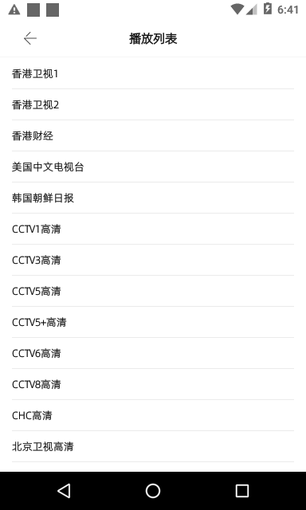

# Android-VideoPlayer
使用`kotlin`开发的一个`Android`视频播放器





### 用到的第三方库
1. [RxJava2](https://github.com/ReactiveX/RxJava)
2. [RxAndroid](https://github.com/ReactiveX/RxAndroid)
3. [RxBinding](https://github.com/JakeWharton/RxBinding)
4. [OKHTTP](https://github.com/square/okhttp)
5. [Retrofit](https://github.com/square/retrofit)
6. [GSON](https://github.com/google/gson)
7. [AutoDispose](https://github.com/uber/AutoDispose)
8. [七牛视频播放器](https://github.com/pili-engineering/PLDroidPlayer)
9. [友盟统计](https://jcenter.bintray.com/com/umeng/)

### 用到的工具
1. [Walle](https://github.com/Meituan-Dianping/walle) 
2. [LeakCanary](https://github.com/square/leakcanary)
3. [AndResGuard](https://github.com/shwenzhang/AndResGuard)
4. [ProGuard](http://blog.fpliu.com/it/software/ProGuard)
5. [ReDex](http://blog.fpliu.com/it/software/ReDex)
6. [360加固保](http://blog.fpliu.com/it/software/360加固保)
7. [libwebp](http://blog.fpliu.com/it/software/libwebp)
8. [7zip](http://blog.fpliu.com/it/software/p7zip)
9. [androidx](https://github.com/leleliu008/androidx)

### 打印日志
```
adb logcat | grep "VP_"
```

### 查看崩溃日志
```
adb shell cat /sdcard/com.fpliu.newton.video.player.sample/log/UncaughtException.log
```

### 构建包
构建`release`包：
```
androidx build --project-dir=DIR --environment=release --webp --jiagu --resguard --channels-gen --channels-zip
```
构建`debug`包：
```
androidx build --project-dir=DIR --environment=debug
```
